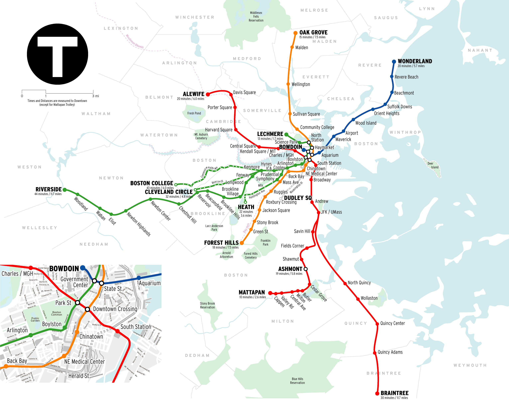
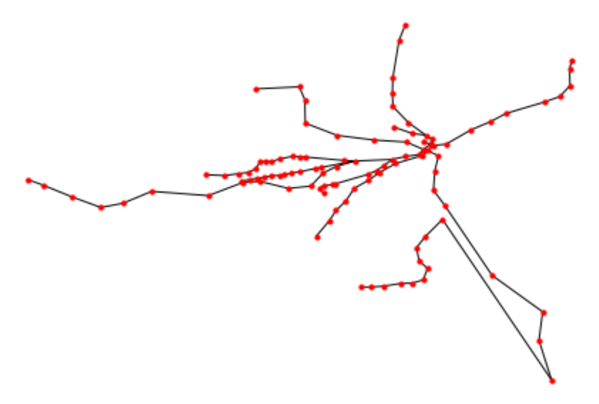

这是第二周课程笔记的第一部分。之所以分两部分，首先是内容比较多，其次是老师也没讲完...本周老师讲到了人工智能的五个模型中的第三个（Search Based 基于搜索的模型）和第四个（Mathematical or Analytical Based 基于数学或统计的模型）。
# 作业
3. Search Based 基于搜索的模型
**作业：设计一个程序分析地铁路线。**

作业要求完成给予任何一个北京地铁的起始站、终点站，返回路线的程序。我先做了一个波士顿地铁的线路分析程序，后来发现北京地铁比波士顿地铁复杂得多，于是又额外做了北京地铁的线路分析程序。本文以波士顿地铁为例，下文会单独写北京地铁的分析。

首先是爬取地铁站信息。我是从波士顿地铁官网（https://www.mbta.com/schedules/subway）爬的。波士顿地铁一共有 4 条线，分别是红线（包含一段支线）、蓝线、橙线和绿线（包含 B、C、D、E 四条支线）。地铁线路图如下：

可以看出，波士顿地铁的体量比较小，跟北京地铁没法比。波士顿地铁只有四个换乘站，分别为 Park Street（红线与绿线换乘）、Downtown Crossing（红线与橙线换乘）、Government Center（绿线与蓝线换乘）、State Street（橙线与蓝线换乘），另外 Haymarket 与 North Station 两站位绿线与橙线共用。所有地铁都是线性的，不像北京地铁还有环线。所以波士顿地铁的路线规划比北京地铁容易得多。爬取网上信息主要使用 `requests` 模块，而处理爬取的信息的方法有很多，这里我用的是 `re` 模块进行正则表达式的分析。首先分析爬取地址：
- 红线：https://www.mbta.com/schedules/Red/line
- 绿线 B Line：https://www.mbta.com/schedules/Green-B/line
刚刚看了两个网页，就可以猜到网址的规律。所有线路的公共部分是 `https://www.mbta.com/schedules/` ，每条地铁线再加上 `线路/Line`。然后使用 Chrome 查看网页的源代码，寻找地铁站的字段。发现字段非常整齐，又给爬取信息降低了难度。以红线终点站 Alewife 为例：
```python
{"z_index":null,"tooltip_text":"Alewife","tooltip":null,"size":null,"rotation_angle":0,"longitude":-71.142483,"latitude":42.395428,"id":"place-alfcl","icon_opts":null,"icon":"stop-circle-bordered-expanded"}
```
又惊喜地发现站点信息里也包含了坐标，真是得来全不费工夫。所以先定义：
```python
url = "https://www.mbta.com/schedules/"
lines = ["Red/line", "Mattapan/line", "Orange/line", "Blue/line",
         "Green-B/line", "Green-C/line", "Green-D/line", "Green-E/line"]
ptn = r'{"z_index":null,"tooltip_text":"(\w+[/ ]?\w+)","tooltip":null,"size":null,"rotation_angle":0,"longitude":(-\d+?.\d+?),"latitude":(\d+?.\d+?),"id":"place-.+?","icon_opts":null,"icon":"stop-circle-bordered-expanded"}'
```
另外我们还需要定义三个变量储存站点坐标、站点和线路，因此定义：
```python
station_coord = dict() # list of stations per line with coordinate
station_per_line = dict() # list of stations per line w/o coordinate
stations = set() # list of stations
```
备用。现在写一个函数，一把梭抓取全部信息：
```python
for line in lines: # 根据上面预先储存的线路依次爬取
    station_in_order = [] # 预备储存站点顺序
    name = line.split("/")[0] # 得到线路名称，做不做都可以
    station = {s:(float(lon), float(lat)) for s, lon, lat in re.findall(ptn, requests.get(url+line).text)} # 一步到位生成以站点为键，坐标为值的字典
    stations.update(station) # order doesn't matter # 把每条线坐标写进总字典
    station_coord.update(station) # order doesn't matter # 把每条线的站名写进总字典
    # the order of station on each line does matter
    station_in_order.append([s for s in re.findall(r'{"z_index":null,"tooltip_text":"(\w+[/ ]?\w+)"', requests.get(url+line).text)]) # 重新爬取字典，有序放进列表
    station_per_line[name] = station_in_order[0] # 将每条线的站点放进总字典
```
结果如何？
```python
>>> print(station_coord,'\n\n',station_per_line,'\n\n',stations)
{'Alewife': (-71.142483, 42.395428), 'Davis': (-71.121815, 42.39674), 'Porter': (-71.119149, 42.3884), ... #省略后面的字符串

{'Red': ['Alewife', 'Davis', 'Porter', 'Harvard', 'Central', 'Kendall/MIT', 'Charles/MGH', 'Park Street', 'Downtown Crossing', 'South Station', 'Broadway', 'Andrew', 'JFK/UMass', 'North Quincy', 'Quincy Center', 'Quincy Adams', 'Braintree', 'Savin Hill', 'Fields Corner', 'Shawmut', 'Ashmont'], ... #省略后面的字符串

{'Longwood', 'Haymarket', 'Arlington', 'Alewife', 'Assembly', 'North Station', 'Lechmere', 'Charles/MGH', 'Reservoir', 'Valley Road', 'Riverside', 'Kendall/MIT', ... #省略后面的字符串
```
爬取圆满成功！这里使用集合和字典是为了去重；而集合和字典是无序变量（字典即将在 Python 3.8 中变有序），因此每条线中的站点需要储存在列表里。

下一步就是创建站点网络了。这里我的想法是：创建一个字典，每一站为键，它的前后站为值，然后画出网络图。这里画网络图使用的是 `networkx` 模块。如果一个站点是始发站或终点站，只需要获得它的下一站/上一站；如果一个站点不是始发站或终点站，则需要获得它的上下站。这里仍然把站点网络存进字典。因为考虑到有若干有中转站，将上下站信息存入集合去重。
```python
connections = dict() # empty dictionary to store connections

for key in station_per_line.keys(): # put every station into dictionary as key with empty value
    for station in station_per_line[key]:
        connections[station] = set() 

for key in station_per_line.keys(): # generate real station network
    for i in range(len(station_per_line[key])):
        if i == 0:
            connections[station_per_line[key][i]].add(station_per_line[key][i+1])
        elif i == len(station_per_line[key])-1:
            connections[station_per_line[key][i]].add(station_per_line[key][i-1])
        else:
            connections[station_per_line[key][i]].add(station_per_line[key][i-1])
            connections[station_per_line[key][i]].add(station_per_line[key][i+1])
```
看一看结果如何？
```python
>>> print(connections)
{'Alewife': {'Davis'}, ... 'North Station': {'Science Park', 'Community College', 'Haymarket'}, 'Haymarket': {'Government Center', 'North Station', 'State'}, 'State': {'Government Center', 'Aquarium', 'Downtown Crossing', 'Haymarket'}, 'Chinatown': {'Downtown Crossing', 'Back Bay'}, ... #省略其它信息
```
可以看到达到预期：'Alewife' 是始发站，因此只有一个连接；'North Station'、'Haymarket' 和 'State' 是换乘站，因此有多个连接；'Chinatown' 是中间站，因此有两个连接。下面是用 networkx 画图了，首先是站点坐标图：
```python
import networkx as nx
%matplotlib inline

station_graph = nx.Graph()                
station_graph.add_nodes_from(stations)
nx.draw(station_graph, station_coord, with_labels=False, node_size=10) # draw a graph of station location
```
, station_coord, with_labels=False, node_size=10) # draw the connection map
```

不得不说，美帝的人心大，数据摆放的这么规矩，一看就没受过爬虫的骚扰。下面是最重要的环节了，设计规划路线的算法。
```python
def search(start, end):
    pathes = [[start]] # 把线路作为列表存在列表里，起始站为第一条线路
    passed = [start] # 储存经过的车站。用集合也许更快一些
    
    while pathes: # 遍历每一条路线
        path = pathes.pop(0) # 取出路线中的第一条
        frontier = path[-1] # 取出当前路线的最后一站
        nxt = connections[frontier] #读取最后一站的上下站
        
        for city in nxt:
            if city in passed:  # 如果本站已经经过，则跳过
                continue
            else:
                new_path = path + [city] # 如果是新站点，则添加到路线的最后
                pathes.append(new_path) # 将这条路线添加进路线的大列表中
                if city == end: return new_path # 如果是终点站，则返回这条路线
                passed.append(city) # 将此站添加进经过的站点中
```
为了让路线图更直观，再定义一个个性化打印的函数：
```python
def pretty_print(lst):
    print("->".join(lst))
```
最后为了好玩（干啥都要好玩！），定义一个要求用户输入起始和终点站，系统返回路径的函数：
```python
start = input("Please type in satrt station: ")
end = input("Please type in destination: ")
while True:
    if start not in stations:
        print("start station not in stations!")
        break
    if end not in stations:
        print("destination not in stations!")
        break
    print("\nYour path is:")
    pretty_print(search(start, end))
    break
```
我的想法开始是分别核对起始和终点站，如果没有就报错。本来想用 `try...exept` 结构，但是想了想觉得没有直接用 `if` 条件简单直接。我试一下：
```python
Please type in satrt station: Malden Center
Please type in destination: Wonderland

Your path is:
Malden Center->Wellington->Assembly->Sullivan Square->Community College->North Station->Haymarket->State->Aquarium->Maverick->Airport->Wood Island->Orient Heights->Suffolk Downs->Beachmont->Revere Beach->Wonderland
```
不得不说，编程有点好玩。。。
