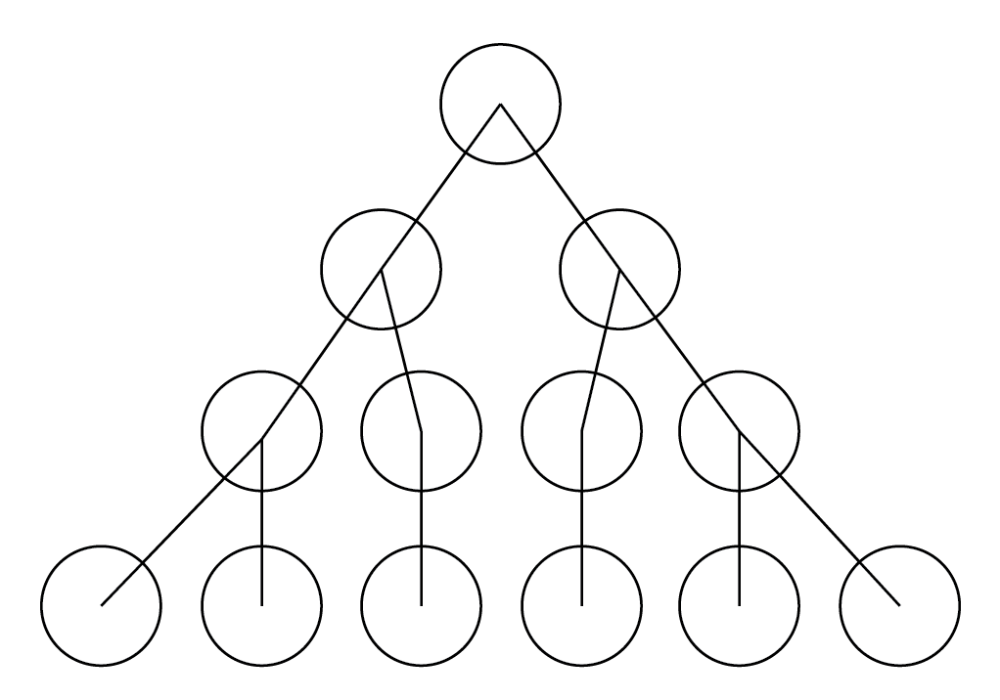

这是第二周学习笔记的第一部分。

# 理论学习

3. Search Based 基于搜索的模型

**问题：假如我们有若干个地点，现在想从地点 A 经过上述地点到地点 B，应该怎么走？**

比如我们有如下地点：沈阳，北京，太原，郑州，兰州，西安，长沙，南宁，福州。现在我想从北京经过上述若干个城市到长沙，应该经过哪些城市？这是一个搜索路线的问题。我们首先做一些数据上的准备：
```python
connection = {
    '北京': ['太原', '沈阳'],
    '太原': ['北京', '西安', '郑州'],
    '兰州': ['西安'],
    '郑州': ['太原'],
    '西安': ['兰州', '长沙'],
    '长沙': ['福州', '南宁'],
    '沈阳': ['北京']
}
```
上面的意思是北京与太原、沈阳相连，以此类推。对于搜索问题，一个办法是遍历所有可能的路线。比如我们可以画出类似的网络图：

最上面的圆圈代表了第一站，下面的两个圆圈代表了可能的下一站，...我们的任务就是找到与下面目的地连接的一条的路线。
