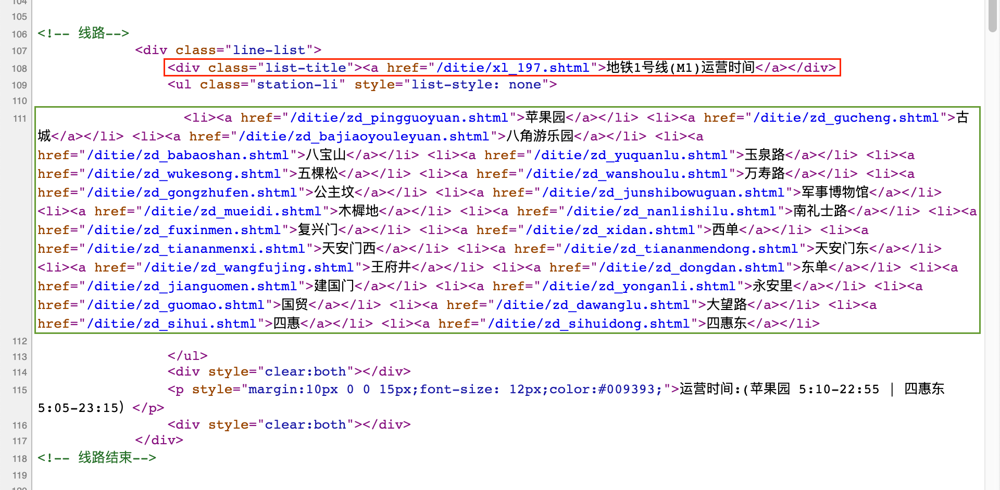
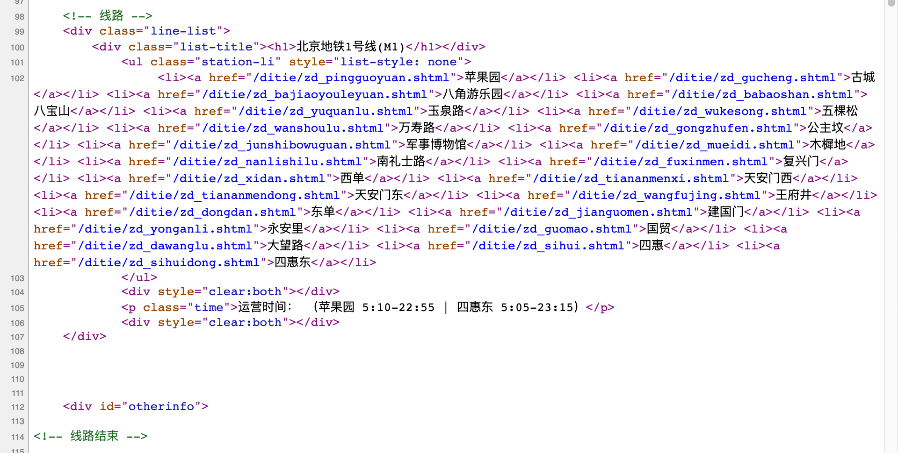
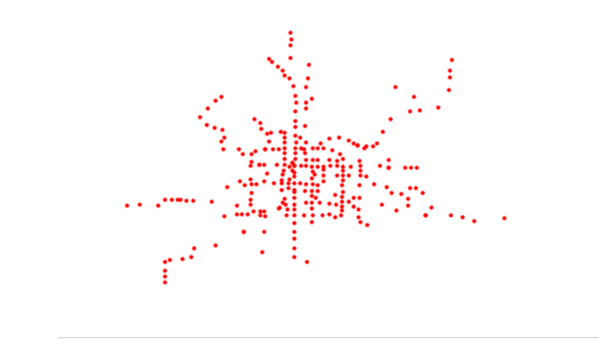

# 本节课笔记目录

- [理论学习](/02_1.md)
- [波士顿地铁路线规划](/02_2.md)
- 作业：北京地铁路线规划（本文）
- [作业：寻找最佳预测拟合模型](/02_4.md)

# 作业：设计程序分析北京地铁路线

上一篇对波士顿地铁的分析只能说是热身，本篇才是真章。因为北京地铁比波士顿地铁大太多了：


北京地铁不仅规模上比波士顿地铁大很多，而且还有两条环线，所以理论上会有很多种走法。老师，你一上来就要大家分析世界第二大地铁系统合适嘛~

老师给的指南里要求大家爬取百度百科的北京地铁词条。这里我要挑事情，作为一个有底线的人，要尽量同没有底线的公司保持距离。所以我爬了一个小网站叫做“[北京本地宝](http://m.bj.bendibao.com/ditie/linemap.shtml)”。因为北京地铁线路比较多，不能像波士顿地铁那样手动填写地铁线路，所以第一件事是爬取地铁线路。观察网页源代码：

红框里的是路线信息，绿框里的是车站信息。可以看到，文本还是很规整的。爬取线路信息加上爬取车站信息。因为担心在同一个网页爬取线路信息和车站信息，会造成线路信息与车站信息错乱的情况，于是我决定先爬取线路信息，然后再单独爬取每条线的车站信息。以地铁 1 号线为例，它的网址是 `http://m.bj.bendibao.com/ditie/xl_197.shtml`，最后的 `xl_197.shtml` 出现在了主页线路信息的文本中，所以获得了线路信息也顺便获得了每条线的网址。

这里有一个小插曲，在我做作业的时候网页源代码完全不是这个样子的，站点分成了有换乘站和没有换乘站两种，本文不同。短短几天，网页就进化了，看来中国的互联网领先不是偶然的（都是 996 拼出来的...)。因为当时文本格式不同，我不得不用一个 `if` 条件分别处理有换乘站和没有换乘站的车站。不过现在发现，老的程序爬取新源代码毫无问题。程序之美~
```python
import re; import requests

url = "http://bj.bendibao.com/ditie/"
lines = re.findall('<a style="color:#.+?;" href="/ditie/(.+?)" target="_blank">', requests.get(url+"linemap.shtml").text)

station_per_line = dict() # list of stations per line w/o coordinate
stations = set() # list of stations

station_with_change = r'<a class="link" href="/ditie/zd_.+?\.shtml">(.+?)$'
station_without_change = '<a href="/ditie/zd_.+?\.shtml" class="link" target="_blank">(.+?)$'
for line in lines:
    station_in_order = []
    # the order of station on each line does matter
    order = []
    for text in requests.get(url+line).text.split("</a>"):
        if re.search(station_with_change, text):
            stations.update(re.findall(station_with_change, text))# order doesn't matter
            order.append(re.findall(station_with_change, text)[0])
        elif re.search(station_without_change, text):
            stations.update(re.findall(station_without_change, text))# order doesn't matter
            order.append(re.findall(station_without_change, text)[0])
        else: continue
    # I have to write a loop becuase stations with change lanes have different patterns
    station_per_line[line] = order
    
station_per_line['map_211.shtml'].append(station_per_line['map_211.shtml'][0])
station_per_line['map_212.shtml'].append(station_per_line['map_212.shtml'][0])
```
因为地铁 5 号线和 10 号线是环线而网站上没有正确闭合，所以在代码结尾手动闭合。爬出来的信息很漂亮：
```python
{'map_197.shtml': ['苹果园', '古城', '八角游乐园', '八宝山', '玉泉路', '五棵松', '万寿路', '公主坟', '军事博物馆', '木樨地', '南礼士路', '复兴门', '西单', '天安门西', '天安门东', '王府井', '东单', '建国门', '永安里', '国贸', '大望路', '四惠', '四惠东'], ... # 后面的信息略
```
下一步是获得地铁站坐标绘图。不像波士顿地铁网站直接提供坐标，这个网站没有提供坐标，所以我使用 Google Map API 获得地铁站坐标。注意 Google Map API 在国内可能无法使用哦。每个地点的查找会返回一段稍微复杂的信息，以'天坛东门'为例：
```python
>>> import googlemaps # get geocodes for stations. May not accessible in China
>>> gmaps = googlemaps.Client(key='...') # use your own key
>>> gmaps.geocode('天坛东门'+'地铁站，北京，中国')
[{'address_components': [{'long_name': 'Tiantan East Gate',
    'short_name': 'Tiantan East Gate',
    'types': ['establishment',
     'point_of_interest',
     'subway_station',
     'transit_station']},
   {'long_name': 'Dongcheng Qu',
    'short_name': 'Dongcheng Qu',
    'types': ['political', 'sublocality', 'sublocality_level_1']},
   {'long_name': 'Beijing Shi',
    'short_name': 'Beijing Shi',
    'types': ['administrative_area_level_1', 'political']},
   {'long_name': 'China',
    'short_name': 'CN',
    'types': ['country', 'political']}],
  'formatted_address': 'Tiantan East Gate, Dongcheng Qu, Beijing Shi, China',
  'geometry': {'location': {'lat': 39.882547, 'lng': 116.420832},
   'location_type': 'GEOMETRIC_CENTER',
   'viewport': {'northeast': {'lat': 39.88389598029149,
     'lng': 116.4221809802915},
    'southwest': {'lat': 39.8811980197085, 'lng': 116.4194830197085}}},
  'place_id': 'ChIJWWVm3aqy8TUR8vtH0_V7S7Q',
  'plus_code': {'compound_code': 'VCMC+28 Dongcheng, Beijing, China',
   'global_code': '8PFRVCMC+28'},
  'types': ['establishment',
   'point_of_interest',
   'subway_station',
   'transit_station']}]
```
怎么找坐标信息看下面的代码：
```python
   station_coord = {}
for s in stations:
    geocode_result = gmaps.geocode(s+'地铁站，北京，中国')
    station_coord[s] = (geocode_result[0]['geometry']['location']['lat'], geocode_result[0]['geometry']['location']['lng'])
station_coord
```
看看爬的结果如何：
```python
{'天坛东门': (39.882547, 116.420832),
 '立水桥': (40.042316, 116.414574),
 '北京南站': (39.865098, 116.378944),
 '莲花桥': (39.8973066, 116.3100612),
 '经海路': (39.784142, 116.563522), ... # 后面的信息略
 ```
 还是非常满意的。下面就是用上一篇里提到的 `networkx` 模块画图了，代码跟波士顿地铁如出一辙，这里不再重复：
 
 
 貌似地铁站的上下站有点问题，不过我也懒得管了，Go Go Go~使用上一篇波士顿地铁的文章中定义的 `search` 函数搜索一下：
 ```python
 >>> pretty_print(search('西直门', '天通苑北'))
 西直门->大钟寺->知春路->五道口->上地->西二旗->龙泽->回龙观->霍营->立水桥->天通苑南->天通苑->天通苑北
 ```
 这个作业还有附加题：
 
 - 增加搜索路线的方法，比如寻找最短、最长、旅行时间最短的路径；
 - 加入中转站。
 
 针对第一个问题，我们只需要对 `search` 函数做一点修改。
 ```python
 from datetime import datetime

def conditional_search(start, destination, sort_method):
    pathes = [[start]]
    visitied = set()
    while pathes: # if we find existing pathes
        path = pathes.pop(0)
        frontier = path[-1]
        if frontier in visitied: continue
        successors = connections[frontier]
        for city in successors:
            if city in path: continue  # eliminate loop
            new_path = path + [city]
            pathes.append(new_path)
            if city == destination: return new_path
        visitied.add(frontier)
        pathes = sort_method(pathes)
```
修改方法是在函数结尾对路线进行排序，因为每次查找线路的时候都取第一条线路，这样可以保证找到的线路是基于第一条线路。
```python
>>> def transfer_as_much_possible(pathes):
...     return sorted(pathes, key=len, reverse=True)
>>> pretty_print(conditional_search('西直门', '西单', sort_method=transfer_as_much_possible))
西直门->车公庄->车公庄西->白石桥南->花园桥->慈寿寺->车道沟->长春桥->火器营->巴沟->苏州街->海淀黄庄->知春里->知春路->西土城->牡丹园->健德门->北土城->安华桥->鼓楼大街->安定门->雍和宫->和平里北街->和平西桥->惠新西街南口->芍药居->太阳宫->三元桥->东直门->东四十条->朝阳门->建国门->东单->灯市口->东四->南锣鼓巷->北海北->平安里->西四->灵境胡同->西单
>>> def transfer_stations_first(pathes): 
...     return sorted(pathes, key=len)
>>> pretty_print(conditional_search('西直门', '西单', sort_method=transfer_stations_first))
西直门->车公庄->阜成门->复兴门->西单
```
看出区别了吧~寻找旅行时间最短的函数中，我依然使用了 Google Map API，但是这里有个 bug：`transit` 模式不知道是哪种交通工具，凑活用吧。
```python
# https://github.com/googlemaps/google-maps-services-python
def transfer_time_first(pathes):
    total_time = []
    for path in pathes:
        for i in range(len(path)-1):
            time = 0
            transit_time = gmaps.directions(path[i]+'地铁站,北京,中国', path[i+1]+'地铁站,北京,中国', mode="transit", departure_time=datetime.now())
            real_time = float(transit_time[0]['legs'][0]['duration']['text'].split()[0])
            # Here is a small problem: I have no idea what "transit" refers to.
            time += real_time
        total_time.append(time)
    # https://stackoverflow.com/questions/6618515/sorting-list-based-on-values-from-another-list
    return [x for _, x in sorted(zip(total_time, pathes))]
```
可能是搜索模式的问题，最后的结果很诡异。最后是带中转站的路线搜索，其实我没有完全做出来：题目说可以带多个中转站，这样需要使用不定长参数，而我只做出来带一个中转站的函数。带一个中转站的函数很简单，把路线分段分别寻找，然后合并即可。
```python
>>> def total_search(start, destination, by_way, sort_method):
...     first_piece = conditional_search(start, by_way, sort_method)
...     second_piece = conditional_search(by_way, destination, sort_method)
...     return pretty_print(first_piece+second_piece[1:]) # remove duplicated station
>>> total_search('西直门', '军事博物馆', '生命科学园', transfer_stations_first)
西直门->大钟寺->知春路->五道口->上地->西二旗->生命科学园->西二旗->上地->五道口->知春路->大钟寺->西直门->车公庄->车公庄西->白石桥南->白堆子->军事博物馆
```