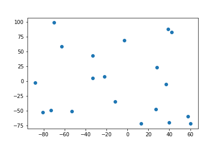
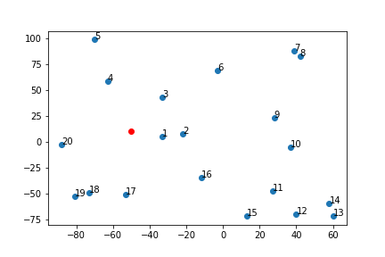

# 动态规划编程（dynamic programming）

本节课老师讲了一个非常重要的概念：动态规划。所谓动态规划指的是一个大问题可以分为若干个相同的小问题（大、小问题相同，只是大小不同）时的一种快速解决问题的办法。为了解决动态规划问题，老师引入了装饰器的功能。关于装饰器，[看这一篇文章就够了](https://foofish.net/python-decorator.html)，但是我还没有理解透，所以本节课的两个例子，我尝试着不用动态规划重新写一遍。（本节课其实一共有三个例子，目前我只看懂两个）

## 割管子问题

假设我们要把一根长管子分成若干段分别卖钱，不同长度的管子有不同的价格。现在有一根给定长度的管子，我们要怎么切割会是售价最高？

首先我们的不同长度的管子的售价如下（索引即为管子的长度）：`original_price = [1, 5, 8, 9, 10, 17, 17, 20, 24, 30]`

我的思路：因为不同长度的管子的单位长度售价不同（性价比不同），那么在切的时候要尽量切出照性价比高的长度。比如有一段长度为 3 的管子，切成 1 和 2（总价为 1+5=6）比切成 3 段 1（总价为 1\*3=3）的售价高，因为 2 的性价比（2.5）比 1 的性价比高。因此我先把长度按照性价比倒序排序，若性价比相同则正序排序（多切一段可以多卖钱）；然后用单位长度去除总长度，假如大于 1（意味着可以切），则售价加这段的价值同时长度减去单位长度；假如小于 1，则看下一个单位长度。先生成所需的数据：
```python
original_price = [1, 5, 8, 9, 10, 17, 17, 20, 24, 30]
dct = {} # 价值为键，长度为值的字典
rate = [] # 不同长度的性价比
for i, j in enumerate(original_price):
    rate.append(j / (i+1))
    dct[j] = i + 1
original_price = [x for x, _ in sorted(zip(original_price, rate), key=lambda x: x[1], reverse=True)]
rate = sorted(rate, reverse=True)
print(f"original price: {original_price}\n")
print(f'rate: {rate}\n')
print(f'pair: {dct}')
```
返回：
```python
original price: [30, 17, 8, 24, 5, 20, 17, 9, 10, 1]

rate: [3.0, 2.8333333333333335, 2.6666666666666665, 2.6666666666666665, 2.5, 2.5, 2.4285714285714284, 2.25, 2.0, 1.0]

pair: {1: 1, 5: 2, 8: 3, 9: 4, 10: 5, 17: 7, 20: 8, 24: 9, 30: 10}
```
定义的算法为：
```python
def best_revenue(num):
    lst = []
    revenue = 0
    while num > 0:
        print(f'initial num: {num}')
        for i in original_price:
            print(f"current i is {i}.")
            while num // dct[i] > 0:
                lst.append(dct[i])
                num -= dct[i]
                print(f'new number is {num}, from subtraction of {dct[i]}.')
                revenue += i
    print(f'The cut method is {lst} with revenue {revenue}')
```
随便用一个数字试一下：
```python
>>> best_revenue(119)
initial num: 119
current i is 30.
new number is 109, from subtraction of 10.
new number is 99, from subtraction of 10.
new number is 89, from subtraction of 10.
new number is 79, from subtraction of 10.
new number is 69, from subtraction of 10.
new number is 59, from subtraction of 10.
new number is 49, from subtraction of 10.
new number is 39, from subtraction of 10.
new number is 29, from subtraction of 10.
new number is 19, from subtraction of 10.
new number is 9, from subtraction of 10.
current i is 17.
new number is 2, from subtraction of 7.
current i is 8.
current i is 24.
current i is 5.
new number is 0, from subtraction of 2.
current i is 20.
current i is 17.
current i is 9.
current i is 10.
current i is 1.
The cut method is [10, 10, 10, 10, 10, 10, 10, 10, 10, 10, 10, 7, 2] with revenue 352
```
这部分代码的 GitHub 地址：https://github.com/vincent507cpu/nlp/blob/master/assignment/03/Part%20I.ipynb

## 行驶路线问题

初始问题：**给定一个初始点 𝑃, 已经 𝑘个车辆，如何从该点出发，经这 k 个车辆经过所以的点全部一次，而且所走过的路程最短?**

说实话我没看懂...所以我自作主张将本问题简化为“**给定一个初始点 𝑃, 有一辆车，如何从该点出发，所有的点全部经过一次，而且所走过的路程最短?**

首先我们来画图：
```python
import random
import matplotlib.pylab as plt

random.seed(1988) # eliminate randomness
latitudes = [random.randint(-100, 100) for _ in range(20)]
longitude = [random.randint(-100, 100) for _ in range(20)]
plt.scatter(latitudes, longitude)
```



标记起始点：
```python
plt.scatter(latitudes, longitude)
plt.scatter([chosen_p[0]], [chosen_p[1]], color='r')
```


算法比较简单：两个循环，第一个循环遍历点的个数（每个点都要走到）；第二个循环计算到各个点的距离，找到距离最短的点，把车所在的点移到该点上，同时将该点添加到已经经过的点的列表里；从头遍历，假如点已经走过，则跳过。
```python
import numpy as np

coordinate = []
for lat, lon in zip(latitudes, longitude):
    coordinate.append((lat,lon)) # 生成坐标
    
def dist(x, y):
    return np.sqrt((x[0]-y[0])**2+(x[1]-y[1])**2) # 计算距离

coordinate_copy = coordinate.copy()
def path(start):
    path = [] # 初始化保存已经经过的点的列表
    for i in range(len(coordinate_copy)): # 第一层循环
        distance = [] # 初始化距离
        for j in range(len(coordinate)): # 第二层循环，计算距离
            distance.append(dist(coordinate[j], start))
        full = zip(coordinate, distance)
        shortest = sorted(full, key=lambda x:x[1])[0] # 根据距离为坐标排序
        path.append(shortest[0])
        start = coordinate.pop(coordinate.index(shortest[0])) # 将点更新为距上一个点距离最短的点
    return path
```
运行一下并画图：
```python
pathes_coord = list(zip(*pathes))
print(pathes_coord)
label = [i+1 for i in range(len(longitude))]
print(label)
plt.scatter([chosen_p[0]], [chosen_p[1]], color='r')
plt.scatter(pathes_coord[0], pathes_coord[1])
for i in range(len(pathes_coord[0])):
    plt.text(pathes_coord[0][i], pathes_coord[1][i], label[i])
```



这部分代码的 GitHub 地址：https://github.com/vincent507cpu/nlp/blob/master/assignment/03/Part%20II.ipynb