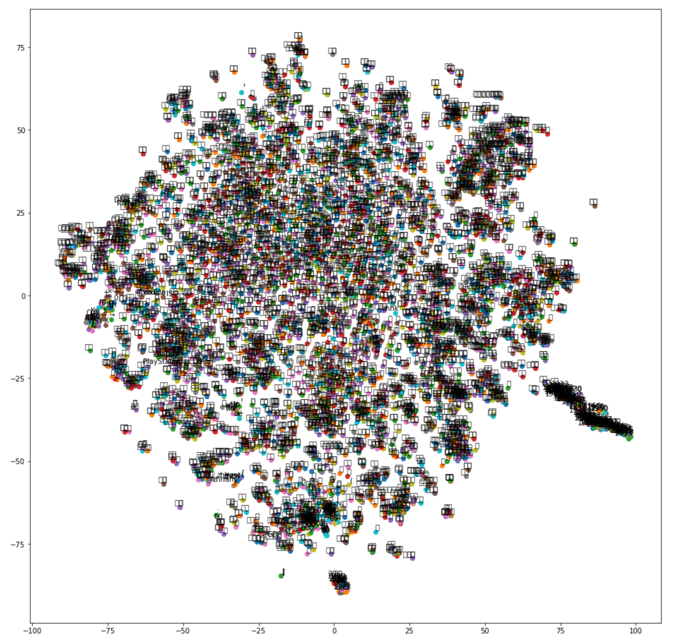
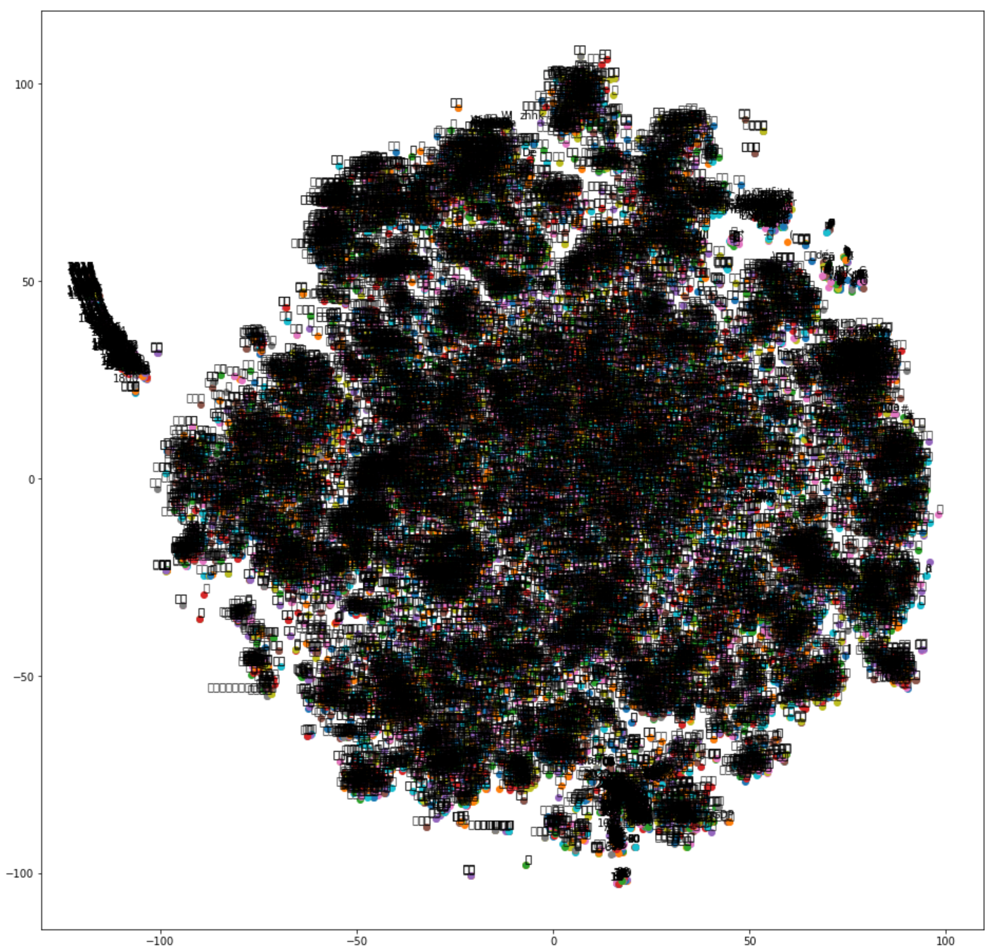

# 自然语言理解初步

终于进入了自然语言处理的部分。不过这次作业真是坑人不浅...几乎要放弃了...

本节课的主要内容是词向量。所谓词向量，指的是不同词语虽然不能直接比较，但把它们转换成多维向量以后可以使用余弦值进行比较，余弦值越大说明两个词越接近。那么怎么将词语转换成向量呢？请参考资料：
- [\[NLP\] 秒懂词向量Word2vec的本质](https://zhuanlan.zhihu.com/p/26306795)；
- [word2vec Parameter Learning Explained](https://arxiv.org/pdf/1411.2738.pdf)；
- [基于 Gensim 的 Word2Vec 实践](https://zhuanlan.zhihu.com/p/24961011)。

## 作业：word2vec 实践

**注：我的作业参考了同学的代码（`https://github.com/junnl/ai-nlp-test/tree/master/assignments_04`，原因下面会提），特此致谢。**

### 语料库的提取及分词

首先我们先下载 [Wikipedia 的中文语料库](https://dumps.wikimedia.org/zhwiki/20190720/)和语料库提取工具：在 GitHub repo 根目录下使用第一行命令，然后使用第二行命令提取语料库：

```shell
git clone https://github.com/attardi/wikiextractor.git
wikiextractor/WikiExtractor.py zhwiki-20190720-pages-articles-multistream.xml -b 2048M -o output # output is the destination folder
```

大约运行了一个半小时，提取出 1067922 篇文章，存放在了 `output/AA/wiki_00` 文件里。这个文件的大小约 1.36GB，里面包含了所有提取的文章。文件的起始部分如下：

```python
<doc id="13" url="https://zh.wikipedia.org/wiki?curid=13" title="数学">
数学

数学是利用符号语言研究數量、结构、变化以及空间等概念的一門学科，从某种角度看屬於形式科學的一種。數學透過抽象化和邏輯推理的使用，由計數、計算、量度和對物體形狀及運動的觀察而產生。數學家們拓展這些概念，為了公式化新的猜想以及從選定的公理及定義中建立起嚴謹推導出的定理。
...
西方语言中“數學”（）一詞源自於古希臘語的（），其有“學習”、“學問”、“科學”，以及另外還有個較狹義且技術性的意思－「數學研究」，即使在其語源內。其形容詞（），意思為"和學習有關的"或"用功的"，亦會被用來指"數學的"。其在英语中表面上的複數形式，及在法语中的表面複數形式'，可溯至拉丁文的中性複數'，由西塞罗譯自希臘文複數（），此一希臘語被亚里士多德拿來指「萬物皆數」的概念。
```
可以看到，文中既有简体字（数学）又有繁体字（數學），为了避免词向量的不一致，需要把文字统一转换成简体字或繁体字。这里我们将使用 `hanziconv` 进行转换。

下面需要将文件载入，除去标点符号并进行分词，最终构建词向量。这里有一个大坑，我被卡在这里若干天。

首先我说一下坑在哪里。本来我考虑某词的词向量创建仅与上下文有关，所以我把整个文件里的文本合并成了一行：
```python
token = []
ptn = '[a-zA-Z0-9\W]' # remove numbers, letters and punctuations

with open("output/AA/wiki_00", "r") as file:
    tmp = []
    para = []
    tmp += re.sub(ptn, "", file.read()) # keep Chinese characters only
    para = ''.join(tmp).strip() # combine strings into a very long string
    token = list(jieba.cut(para))
```
这样结构分词以后得到了这样的列表:
```python
['数学', '数学', '数学', '是', '利用', '符号语言', '研究', '數量',...]
```
**这个坑就是：构建词向量不能使用一维列表，换句话说必须保留段落信息，也就是使用嵌套列表，否则会出错。**我们以上面的列表构建词向量：
```python
from gensim.models import Word2Vec
model = Word2Vec(token, size=100, window=20, min_count=5, workers=8)
```
结果不能检测任何一个词条:
```python
>>> model.wv.vocab[u'美丽']
---------------------------------------------------------------------------
KeyError                                  Traceback (most recent call last)
<ipython-input-8-7067e81bb164> in <module>
----> 1 model.wv.vocab[u'美丽']

KeyError: '美丽'
```
我卡在这里好几天，想死的心都有...最后还是看了上面的同学作业才明白。明白了不能将语料库转换为一行以后，后面就比较直接了：
```python
ptn1 = '<.+?>' 
ptn2 = "[“”，。「」（）《》、\'·\"\-]"# remove punctuations

outfile = open('new.txt', 'w')
with open('wiki_00') as f:
    lines = f.readlines()
    for line in lines:
        line = re.sub(ptn1, '', line)
        line = re.sub(ptn2, '', line)
        line = HanziConv.toSimplified(line)
        outfile.write(line)
    print("Done!")
outfile.close()
```
首先，文章顶部的`<doc id="13" url="https://zh.wikipedia.org/wiki?curid=13" title="数学">` 不需要，去掉。其次，标点符号不需要，去掉。最后，需要将文字转换为简体字，然后将文字储存备用。我们习惯使用 `pandas` 的 `read_csv` 函数，对于普通文本文档则需要使用 `open` 函数。`open` 函数的默认模式是 `'r'` 即读取，而写入的模式是 `'w'`。在打开文件以后需要使用 `.close()` 将文件关闭，释放内存。而使用  `with open(...)` 则会在打开文件以后自动关闭文件。上面的 `.readlines()` 读取文件中的所有行，然后每行分别进行处理即可。然后使用 `outfile.write(line)` 写入文件。我们来看一下处理结果：
```python
['\n', '数学\n', '\n', '数学是利用符号语言研究数量结构变化以及空间等概念的一门学科从某种角度看属于形式科学的一种数学透过抽象化和逻辑推理的使用由计数计算量度和对物体形状及运动的观察而产生数学家们拓展这些概念为了公式化新的猜想以及从选定的公理及定义中建立起严谨推导出的定理\n', '\n']
```
首先我们对文本进行分词：
```python
with open('new.txt') as f:
    lines = f.readlines()
    for i in range(1000000):
        token.append(list(jieba.cut(lines[i]))) # database is too large, takes forever
```
结果如下：
```python
[['\n'], ['数学', '\n'], ['\n'], ['数学', '是', '利用', '符号语言', '研究', '数量', '结构', '变化', '以及', '空间', '等', '概念', '的', '一门', '学科', '从', '某种', '角度看', '属于', '形式', '科学', '的', '一种', '数学', '透过', '抽象化', '和', '逻辑推理', '的', '使用', '由', '计数', '计算', '量度', '和', '对', '物体', '形状', '及', '运动', '的', '观察', '而', '产生', '数学家', '们', '拓展', '这些', '概念', '为了', '公式化', '新', '的', '猜想', '以及', '从', '选定', '的', '公理', '及', '定义', '中', '建立', '起', '严谨', '推导', '出', '的', '定理', '\n'], ['\n']...]
```
`"\n"` 本身也是一个词，会影响词向量的创建，需要去掉。要注意的是，换行符不能在最开始去除，否则所有段落又会合并。我们使用下面的代码去除换行符：
```python
token = []
for snippet in token:
    new_token.append([piece for piece in snippet if piece != "\n"]) # replace "\n" by whitespace
```
结果如下：
```python
[[], ['数学'], [], ['数学', '是', '利用', '符号语言', '研究', '数量', '结构', '变化', '以及', '空间', '等', '概念', '的', '一门', '学科', '从', '某种', '角度看', '属于', '形式', '科学', '的', '一种', '数学', '透过', '抽象化', '和', '逻辑推理', '的', '使用', '由', '计数', '计算', '量度', '和', '对', '物体', '形状', '及', '运动', '的', '观察', '而', '产生', '数学家', '们', '拓展', '这些', '概念', '为了', '公式化', '新', '的', '猜想', '以及', '从', '选定', '的', '公理', '及', '定义', '中', '建立', '起', '严谨', '推导', '出', '的', '定理'], []...]
```
理论上 `[]` 不会被纳入词向量的创建，但是考虑到可能会影响词语的上下文联系，所以一并去除：
```python
newer_token = [piece for piece in new_token if piece] # remove whitespace
```
最后结果看起来好多了：
```python
[['数学'], ['数学', '是', '利用', '符号语言', '研究', '数量', '结构', '变化', '以及', '空间', '等', '概念', '的', '一门', '学科', '从', '某种', '角度看', '属于', '形式', '科学', '的', '一种', '数学', '透过', '抽象化', '和', '逻辑推理', '的', '使用', '由', '计数', '计算', '量度', '和', '对', '物体', '形状', '及', '运动', '的', '观察', '而', '产生', '数学家', '们', '拓展', '这些', '概念', '为了', '公式化', '新', '的', '猜想', '以及', '从', '选定', '的', '公理', '及', '定义', '中', '建立', '起', '严谨', '推导', '出', '的', '定理']...]
```
### 词向量的构建及验证
这里为了尽可能地获得多的词语关系，词频阈值 `min_count` 设置为 5。
```python
model = Word2Vec(newer_token, size=100, window=20, min_count=5, workers=8)
```
在测试以前，需要知道词向量里有哪些词。这里我没有做，但是可以提供一个思路：使用 collections 里的 Counter 函数统计分词列表里的词，然后过滤出多于词频阈值的词。需要注意的是，语料库越大，词向量就越准确，同时消耗的计算机资源就越多。我的电脑不足以支撑整个语料库的运算，所以只使用了前 100 万自然段进行词向量创建。我们验证一下：
```python
>>> model.wv.similarity('数学', '科学')
0.5536639
>>> model.wv.most_similar(['美丽'])
[('可爱', 0.7078941464424133),
 ('丑陋', 0.6844089031219482),
 ('最美', 0.6722203493118286),
 ('美好', 0.670589804649353),
 ('漫步', 0.6539715528488159),
 ('寂寞', 0.6452400088310242),
 ('景色', 0.6442990303039551),
 ('欢乐', 0.6432660222053528),
 ('天堂', 0.6419087648391724),
 ('神奇', 0.6222221851348877)]
>>> model.wv.most_similar(positive=['巨大', '大'], negative=['小'],topn=2)
[('极大', 0.6541517376899719), ('前所未有', 0.6429072618484497)]
```
前面说 `"\n"` 本身也是一个词，会影响词向量的创建。我们使用 `token`（包含 `"\n"`）创建一个词向量来看一下：
```python
>>> model2.wv.most_similar(['\n'])
[('如', 0.45283541083335876),
 ('例如', 0.4350649118423462),
 ('运输网', 0.4050900936126709),
 ('千家万户', 0.40454530715942383),
 ('该类', 0.4027630686759949),
 ('此外', 0.39057761430740356),
 ('遗产地', 0.3904579281806946),
 ('诸如', 0.3902575373649597),
 ('难易', 0.3768627345561981),
 ('KTV', 0.3742178976535797)]
```
### 词向量的可视化
这里我们使用现成的脚本：[Visualizing Word Vectors with t-SNE](https://www.kaggle.com/jeffd23/visualizing-word-vectors-with-t-sne)。注意，由于语料库比较大，节点也会比较多，需要大量计算机资源进行绘图，所以词频阈值 `min_count` 应设置为一个较大的数，否则图像会是一个黑团。首先是稀疏点图（min_count=500）：

然后是致密点图（min_count=100）：
